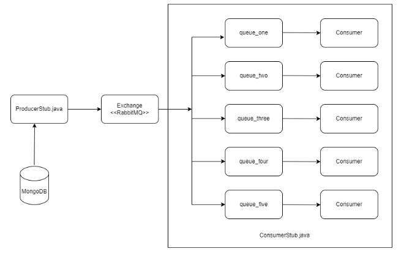
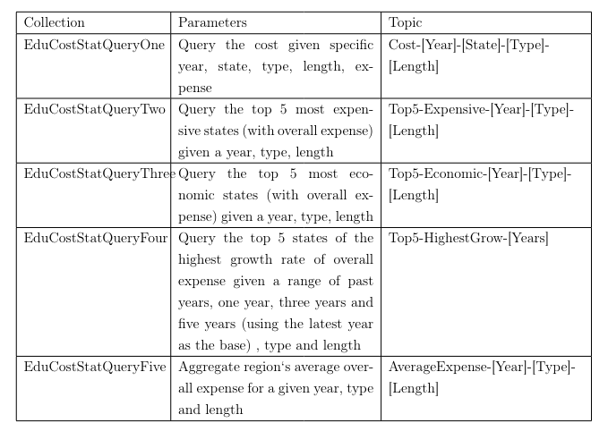

## Introduction
This project aims to deploy and configure RabbitMQ, a messaging broker, on both Linux and Windows environments. RabbitMQ facilitates communication between various components of distributed systems using the AMQP protocol. The project involves installation, configuration, and troubleshooting of RabbitMQ instances to ensure seamless messaging capabilities across the producers and consumers in a distributed system.

As can be seen in the figure above, the ProducerStub.java retrieves data from various collections in the database for the listed topics, as illustrated in the table above, and publishes it to the RabbitMQ Exchange. As consumers in the different queue-bindings continue to listen, they immediately receive the messages once published by the ProducerStub.java.

## Project Structure
This project architecture uses the rabbitmq framework designed to efficiently manage the retrieval and processing of education cost statistics. The key components of our architecture include:

ProducerStub.java: 

This component is responsible for retrieving data from various collections in the database related to the listed topics. It acts as a bridge between the database and the RabbitMQ Exchange, facilitating the publishing of data to the appropriate queues.

Exchange.java: 

The Exchange module serves as a central hub for message routing within the RabbitMQ system. It receives messages from producers like ProducerStub.java and routes them to the appropriate queues based on predefined routing rules.

ConsumerStub.java: 

ConsumerStub.java represents the consumer side of the messaging system. It listens on specific queues for incoming messages and processes them accordingly. This component plays a crucial role in consuming and processing the data published by ProducerStub.java.

config.properties file: 

This configuration file contains various settings and parameters required by the different components of the system. It provides flexibility and ease of configuration, allowing for easy customization of the system’s behavior. 

As a result of this implementation, we have achieved seamless communication and efficient data processing. This project architecture promotes modularity, scalability, and maintainability by adhering to best practices in distributed systems design. By leveraging modern technologies such as RabbitMQ and Java, we empower users to retrieve and analyze education cost statistics with ease.

#### NB: To run this code, you need to have rabbitmq & erlang installed and running in your system environment.
